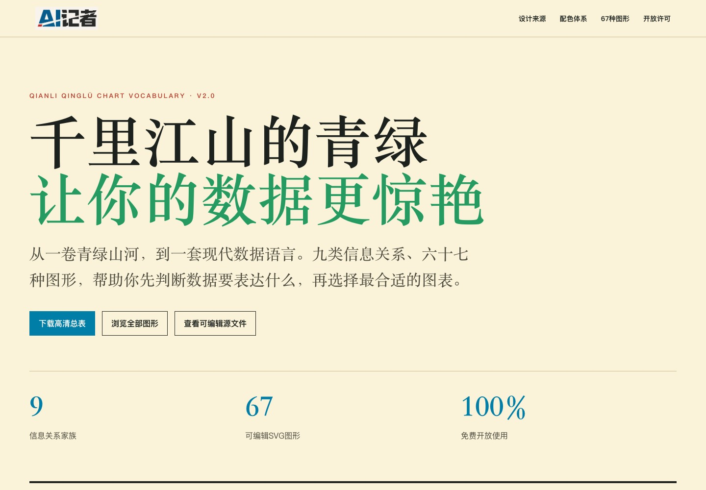

# Qianli Qinglü Chart Vocabulary 2.0

> Colour-purified edition: brighter screen colours for data marks, with darker tonal partners for readable small text.

Qianli Qinglü is an open chart vocabulary inspired by the ordered intensity of Chinese blue-green landscape painting. Version 2.0 includes 9 relationship families, 67 editable SVG examples, a high-resolution poster, an editable HTML source and portable colour tokens.

## What is included

- 9 relationship families: change over time, ranking, deviation, magnitude, distribution, correlation, part-to-whole, flow and relationship, and spatial;
- 67 standalone editable SVG examples;
- a high-resolution overview poster;
- an editable standalone HTML source;
- JSON chart manifest and color tokens;
- chart selection, color usage and attribution guides.

## Design principle

Choose the relationship before choosing the chart. Colour supports hierarchy and emphasis but never carries a distinction alone. Position, ordering, direct labels, line style, marker shape and open fills remain part of the visual language. The Public Domain reference artwork remains unaltered; the chart system uses a separate high-chroma screen translation rather than sampling the aged image as if it represented original pigment intensity.

The vivid roots are `#007EA7`, `#259B62`, `#D99A16`, `#E14B32` and `#8351B2`. They are used for marks. Small coloured text uses darker partners that meet the contrast target on `#FAF2D9` paper.

## License

- HTML, CSS, JSON and build scripts: MIT License;
- poster, SVG charts and documentation: CC BY 4.0;
- painting reference: Public Domain Mark 1.0; see `ASSET-LICENSES.md`;
- the AI记者 / AI Reporter name and logo are brand-reserved and excluded from the open licenses.

This is an independent project. It is not affiliated with or endorsed by the Palace Museum, the Financial Times or the Wikimedia Foundation.

Chinese documentation: [README.md](README.md)
